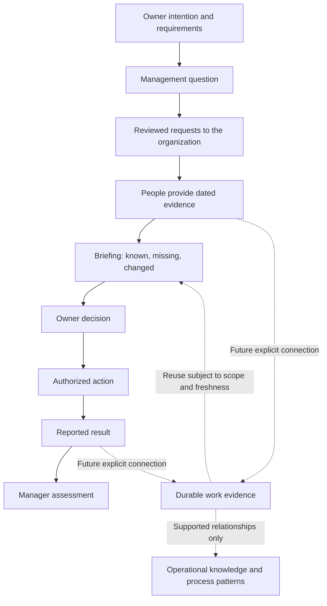

# One SME AI platform, two useful starting points

Strategy date: 26 September 2026. This document distinguishes the intended platform from implemented product behavior. The [product contract](PRODUCT.md) and [v0.2 contract](V02-CONTRACT.md) remain the implementation references.

## The purpose remains the same

Workwork should help SME owners use AI to organize their company’s work, communicate direction, assign responsibilities and understand execution. Management supplies intentions and authority. Employees supply facts about work and results. The service connects those inputs, reduces coordination effort and makes uncertainty visible.

Top-down input includes objectives, expected outcomes and mandatory work or procedures. Bottom-up input includes observations, completed activities, obstacles, dependencies and measured results. These describe different perspectives on the same business. Employees should not have to construct an ontology, manually map every entry to a goal, or draw processes before the product becomes useful.

## How the two products fit

| Product | Starting point | Intended value |
|---|---|---|
| Workwork Cloud | Work evidence and company expectations accumulate through Work and Goals. | A durable account of what happened, how work relates to objectives, and which operational relationships the evidence supports. |
| Quick View | An owner has a concrete question requiring an organizational response. | A focused answer assembled from people’s evidence, followed by a decision and accountable next steps. |

Quick View addresses the initial lack of data: a useful management question motivates targeted evidence collection immediately. It need not wait for a comprehensive work-log history. Workwork Cloud supplies the longer-term direction: accumulated evidence should become reusable operational knowledge.

These are currently separate repositories, deployments, accounts and databases. There is no synchronization. The strategic connection is a product direction, not an existing integration or a requirement to modify the original service.

## A compact semantic model

The following distinctions describe meaning and authority, rather than a mandatory set of screens. They are not a strictly exhaustive MECE taxonomy: one document can support several roles, but each relationship should retain its meaning.

| Concept | Meaning and boundary |
|---|---|
| **Intention** | An objective, target or required procedure, with scope and effective period. A desired outcome is not evidence of achievement. |
| **Request** | An authorized question seeking specific information from a responsible person. Answering it is different from performing an operational task. |
| **Evidence / observation** | What someone reports or a source records, with authorship, observation time, scope and uncertainty. Recording time is separate. |
| **Decision** | An authorized judgment or direction linked to the evidence considered. It does not automatically remove the underlying problem. |
| **Assigned action** | Authorized work with a responsible person, expected result and optional deadline. AI suggestions become assignments only through authorization. |
| **Reported result** | An account of an action’s outcome and supporting evidence. It may disclose failure, partial completion or an unresolved obstacle. |
| **Manager acceptance** | A manager’s assessment of a reported result. Acceptance is neither independent verification nor proof that a business KPI improved. |
| **Discovered process** | A proposed description of operational relationships supported by evidence. Repeated reporting order alone does not establish a production dependency. |

A request, action and observation can concern the same order or batch. That shared business reference connects them without equating them. Required procedures remain separate from discovered practice, allowing the service to show evidence gaps without declaring that undocumented work never occurred.

The solid arrows describe the management loop. They are not inferred factory process edges. Dotted connections express the proposed relationship between the products.

## A manufacturing example

The owner’s intention is to meet promised delivery dates, with quality release required before dispatch. The immediate question is: “Which orders due Friday need my intervention?”

Sales identifies the relevant orders. Production reports that batch B17 is packed. Quality reports that release authorization is still pending. Logistics reports that the carrier needs confirmation by noon. Each response retains its source and observation time; “packed” cannot be converted into “ready to deliver.”

The owner decides to reserve a later collection subject to quality release, assigning logistics to return a booking reference. Logistics reports a booking, and the owner assesses that reported result. Quality release can remain unresolved even after the booking action is accepted.

Next week’s check-in reuses the response plan, with a new scope. Last week’s booking is dated context, not evidence that this week’s orders are covered. Over time, consistent batch references and documented prerequisites may support a recurring release-to-dispatch relationship. A numeric on-time delivery KPI still needs its own definition, eligible orders, promised dates and actual delivery outcomes.

## Where AI helps, and where people remain essential

Optional AI can propose question breakdowns, improve response wording, suggest relevant prior evidence and organize candidate relationships. It should expose uncertainty and preserve source access. Fluent output cannot supply a missing approval, measurement or business fact.

Owners authorize priorities and assignments. Contributors assert observations and report uncertainty. Managers assess results. Guided templates remain a legitimate baseline; model assistance must improve draft usefulness and reduce effort against that baseline. The public product must identify its configured mode accurately.

An eventual connection between products should preserve company permissions, original source IDs, versions, authorship, observation time and scope. Corrected evidence must be recognizable, and duplicated imports must not become additional independent observations. A response may supply work evidence without making a request-completion statistic into an outcome metric. Integration requires an explicit design and migration decision; it is not implicit in using both products.

## What could differentiate, and what to do next

The strongest hypothesis is a compact manufacturing management loop that owners and employees can sustain: specific questions, little repeated input, inspectable evidence and visible follow-through. The [research assessment](CONCEPT-AND-VIABILITY-REVIEW.md) explains why generic AI reporting is insufficient differentiation. Useful workflow knowledge and low implementation effort must be demonstrated in practice.

1. **Prove one loop.** Pilot weekly delivery exceptions. Measure owner, coordinator and employee effort together, repeated independent use and paid continuation using the [pilot plan](PILOT-AND-COMMERCIAL-PLAN.md).
2. **Make participation dependable.** Prioritize Korean usability, phone use, account recovery, appropriate access, backup operations and the communication channel actual participants need.
3. **Make repetition easier.** Refine reusable questions, dated rechecks and evidence reuse. Evaluate optional model assistance on representative, de-identified questions before expanding claims.
4. **Connect the foundation deliberately.** After retained usage, design an authorized connection to durable Workwork evidence and valid KPI measurements. Introduce process discovery only where recorded relationships support it.

The subscription should earn renewal by helping a company make and follow through on better-informed decisions. Accumulated organizational knowledge is the growing benefit of that useful recurring activity.
